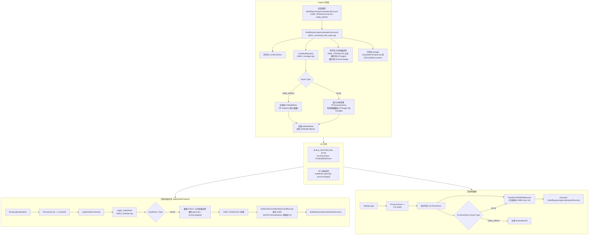

# OMM (Opacity Micromap) Capture/Replay 设计文档

## 概述

本文件记录了 RenderDoc 对 D3D12 Opacity Micromap (OMM) 的 capture/replay 支持，涉及两种加速结构类型：

- **OMM_ARRAY** (`D3D12_RAYTRACING_ACCELERATION_STRUCTURE_TYPE_OPACITY_MICROMAP_ARRAY`)
- **OMM_TRIANGLES** (`D3D12_RAYTRACING_GEOMETRY_TYPE_OMM_TRIANGLES`) — 作为 BLAS 的几何体类型

---

## 数据结构

### RTGeometryDesc (`d3d12_manager.h`)

`RTGeometryDesc`是与`D3D12_RAYTRACING_GEOMETRY_DESC`大小一致的 RVA 版本，用于 ASBuildData 中的几何体描述。

```cpp
struct RTGeometryDesc
{
    D3D12_RAYTRACING_GEOMETRY_TYPE Type;
    D3D12_RAYTRACING_GEOMETRY_FLAGS Flags;
    union
    {
        RVATrianglesDesc Triangles;    // TRIANGLES + OMM_TRIANGLES 共享
        RVAAABBDesc AABBs;             // PROCEDURAL_PRIMITIVE_AABBS
        RVAOMMTrianglesDesc OmmTriangles; // OMM_TRIANGLES 的 raw 指针占位
    };
};
```

**关键点**：OMM_TRIANGLES 在 capture 时通过构造函数将 `pTriangles` 指向的数据复制到 `Triangles` union 成员中，因此下游代码（大小计算、数据复制）可统一通过 `Triangles` 读取，无需区分 TRIANGLES / OMM_TRIANGLES。

### RVAOMMLinkageDesc (`d3d12_manager.h`)

OMM linkage 数据的 RVA 版本，与 `ommLinkages[]` 并行数组配套使用。

```cpp
struct RVAOMMLinkageDesc
{
    uint64_t OpacityMicromapIndexBuffer;           // RVA
    DXGI_FORMAT OpacityMicromapIndexFormat;
    UINT OpacityMicromapBaseLocation;
    uint64_t OpacityMicromapArrayRVA;              // RVA
    D3D12_GPU_VIRTUAL_ADDRESS OriginalOpacityMicromapArrayVA; // 原始 capture VA
};
```

---

## 序列化

### OMM_TRIANGLES 几何体序列化 (`d3d12_serialise.cpp`)

`DoSerialise(D3D12_RAYTRACING_GEOMETRY_DESC)` 中的 OMM_TRIANGLES 分支：

- **写时**：解引用 `pTriangles` 和 `pOmmLinkage` 指针，分别序列化 `D3D12_RAYTRACING_GEOMETRY_TRIANGLES_DESC` 和 `D3D12_RAYTRACING_GEOMETRY_OMM_LINKAGE_DESC`
- **读时**：`new` 分配对象，指针指向新分配的内存（在 `Deserialise` 中释放）

### OMM Linkage 序列化 (`d3d12_serialise.cpp`)

`DoSerialise(D3D12_RAYTRACING_GEOMETRY_OMM_LINKAGE_DESC)`：

| 字段 | 序列化方式 | 说明 |
|------|-----------|------|
| `OpacityMicromapIndexBuffer` | `SERIALISE_MEMBER` (D3D12_GPU_VIRTUAL_ADDRESS_AND_STRIDE) | buffer 地址，通过 StartAddress 的 D3D12BufferLocation 自动重映射 |
| `OpacityMicromapIndexFormat` | `SERIALISE_MEMBER` | 直接序列化 |
| `OpacityMicromapBaseLocation` | `SERIALISE_MEMBER` | 直接序列化 |
| `OpacityMicromapArray` | `SERIALISE_MEMBER_TYPED(D3D12BufferLocation)` | **关键**：使用 D3D12BufferLocation 将 GPU VA 映射为 bufferId + offset，回放时自动恢复为回放地址 |

### ASBuildData 初始状态序列化 (`d3d12_initstate.cpp`)

初始状态下序列化 `geoms[]` 和 `ommLinkages[]` 两个并行数组。

---

## Capture 流程

### 1. OMM_ARRAY 构建

在 `CopyBuildInputs()` (`d3d12_manager.cpp`) 中：
- 创建空 `ASBuildData` 仅用于 AS 生命周期追踪
- 不 snapshot 输入数据（`InputBuffer` 和 `PerOmmDescs` 作为常规 GPU 资源追踪）
- `ommReferences` 用于记录 BLAS 对 OMM Array 的引用（为 replay patching 准备 VA 映射）

### 2. OMM_TRIANGLES BLAS 构建

在 `CopyBuildInputs()` 中：
- `RTGeometryDesc` 构造函数通过 `memcpy` 将 `D3D12_RAYTRACING_GEOMETRY_DESC` 转为 RTGeometryDesc。
- 对于 OMM_TRIANGLES，构造函数跟随 `pTriangles` 指针将三角形数据填入 `Triangles` union。
- 从 `pOmmLinkage` 提取 linkage 数据存入并行 `ommLinkages[]` 数组。
- 将 `OriginalOpacityMicromapArrayVA` 存入 `RVAOMMLinkageDesc`。

### 3. 资源标记 (`BuildRaytracingAccelerationStructure`)

在 `BuildRaytracingAccelerationStructure()` (`d3d12_command_list4_wrap.cpp`) 中：
- OMM_TRIANGLES 几何体的 triangle buffers（Index/Transform/Vertex）标记为读引用
- OMM index buffer 标记为读引用
- OMM Array buffer 标记为读引用
- OMM_ARRAY 类型额外标记 `InputBuffer` 和 `PerOmmDescs`

---

## Replay 流程

### 初始状态 Apply_InitialState (`d3d12_initstate.cpp`)

对于 BLAS（含 OMM_TRIANGLES）：
1. 从序列化数据重建 `D3D12_RAYTRACING_GEOMETRY_DESC[]` 临时数组
2. 对每个 OMM_TRIANGLES 几何体：
   - 从 `Triangles` union memcpy 回 `D3D12_RAYTRACING_GEOMETRY_TRIANGLES_DESC`
   - 从 `ommLinkages[]` 填充 `D3D12_RAYTRACING_GEOMETRY_OMM_LINKAGE_DESC`
   - 重映射 `OriginalOpacityMicromapArrayVA`：通过 `GetResIDFromAddrAllowOutOfBounds` + `GetGPUVirtualAddress` 将 capture 时的 GPU VA 转换为回放地址
3. 获取 prebuild info 并执行 `BuildRaytracingAccelerationStructure`

对于 OMM_ARRAY：
- 跳过（初始状态不重建 OMM Array）

### 帧回放 Serialise_BuildRaytracingAccelerationStructure (`d3d12_command_list4_wrap.cpp`)

1. 反序列化 `AccStructDesc`
2. 对 BLAS 调用 `PatchBLASOMMAddresses()`（可选修补，查找 VA 映射表将 OpacityMicromapArray 更新为回放 AS 地址）
3. 调用 `Unwrap4(pCommandList)->BuildRaytracingAccelerationStructure()`

### PatchBLASOMMAddresses

在回放时尝试通过 `FindOMMArrayByOriginalVA` 查找 OMM Array AS wrapper，如果找到则将 `OpacityMicromapArray` 更新为回放 AS 的 GPU VA。如果找不到（例如 OMM Array 尚未在该帧被构建），不报错——因为 `D3D12BufferLocation` 已经保证了地址正确。

---

## 已移除的复杂方案（历史记录）

为避免其他开发者走弯路，记录以下被摒弃的方案：

1. **`ASBuildData::OMMArrayOriginalVA` 字段** — 最早方案试图通过给 ASBuildData 添加字段来传递 OMM Array capture-time VA，但增加了数据结构复杂度
2. **`D3D12ResourceManager::PrepopulateOMMArrayVAMap`** — 在 ApplyInitialContents 前预填充 VA 映射表，但依赖处理顺序且需要遍历所有初始内容
3. **`Apply_InitialState` 中 RecordOMMArrayVA** — 在处理 OMM Array AS 时填充 VA 映射，但 BLAS 和 OMM Array 的处理顺序不确定
4. **`PatchBLASOMMAddresses` 的 RDCERR** — 将查找失败视为错误，但实际上 D3D12BufferLocation 已保证地址正确

**最终方案**的核心思路：**OpacityMicromapArray 本质上指向一个 buffer 地址，用 `D3D12BufferLocation` 即可自动处理回放时的地址重映射，无需额外的 VA 映射表**。

---

## 修改文件清单

| 文件 | 修改内容 |
|------|---------|
| `renderdoc/driver/d3d12/d3d12_manager.h` | RTGeometryDesc union 增加 OmmTriangles 成员；RVAOMMTrianglesDesc 结构体；RVAOMMLinkageDesc 结构体 |
| `renderdoc/driver/d3d12/d3d12_manager.cpp` | CopyBuildInputs 支持 OMM_ARRAY 和 OMM_TRIANGLES；ommReferences VA 映射；OMM 索引缓冲区复制 |
| `renderdoc/driver/d3d12/d3d12_serialise.cpp` | DoSerialise(RAYTRACING_GEOMETRY_DESC) OMM_TRIANGLES 分支；DoSerialise(OMM_LINKAGE_DESC/ARRAY_DESC/HISTOGRAM_ENTRY)；Deserialise 清理 |
| `renderdoc/driver/d3d12/d3d12_common.h` | DECLARE_REFLECTION_STRUCT/ENUM 声明 |
| `renderdoc/driver/d3d12/d3d12_stringise.cpp` | DoStringise(OMM_FORMAT) |
| `renderdoc/driver/d3d12/d3d12_initstate.cpp` | Apply_InitialState OMM_TRIANGLES 几何体描述符重建；OMM Array VA 手动重映射 |
| `renderdoc/driver/d3d12/d3d12_command_list4_wrap.cpp` | BuildRaytracingAccelerationStructure 资源标记；PatchBLASOMMAddresses；Serialise_Build 支持 OMM_ARRAY |

---

## 工作流程图



### 阶段说明

| 阶段 | 关键动作 | 核心文件 |
|------|---------|---------|
| **Capture OMM_TRIANGLES** | `RTGeometryDesc` 构造函数解析 `pTriangles`；`DoSerialise` 序列化指针指向的数据 | `d3d12_manager.cpp`、`d3d12_serialise.cpp` |
| **Capture OMM_ARRAY** | 创建空 `ASBuildData`，不 snapshot | `d3d12_manager.cpp` |
| **序列化 linkage** | `OpacityMicromapArray` 通过 `D3D12BufferLocation` 保存 buffer 引用 | `d3d12_serialise.cpp` |
| **回放 ApplyInitialState** | 手动重映射 `OriginalOpacityMicromapArrayVA` 为 replay buffer 地址 | `d3d12_initstate.cpp` |
| **回放帧数据** | `PatchBLASOMMAddresses` 可选修补 VA；直接调用 D3D12 API | `d3d12_command_list4_wrap.cpp` |
