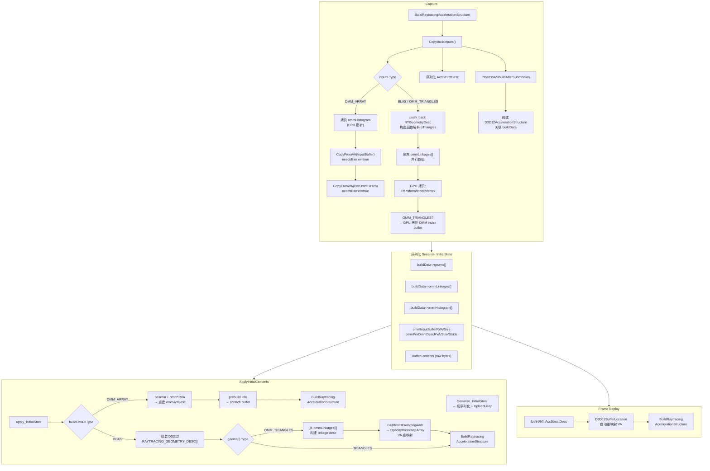

# OMM (Opacity Micromap) Capture/Replay 设计文档

## 概述

本文件记录了 RenderDoc 对 D3D12 Opacity Micromap (OMM) 的 capture/replay 支持。

涉及两种加速结构类型：

- **OMM_ARRAY** (`D3D12_RAYTRACING_ACCELERATION_STRUCTURE_TYPE_OPACITY_MICROMAP_ARRAY`) — 独立的加速结构，存储 Micromap 数据
- **OMM_TRIANGLES** (`D3D12_RAYTRACING_GEOMETRY_TYPE_OMM_TRIANGLES`) — BLAS 中的几何体类型，通过 linkage 引用 OMM Array

---

## 数据流总览

```
Capture:
  BuildRaytracingAccelerationStructure()
    → CopyBuildInputs(): 快照输入数据到 ReadBackHeap buffer
    → Serialise: 序列化 AccStructDesc + ASBuildData (含 buffer content)
    → ProcessASBuildAfterSubmission(): 创建 AS wrapper, 关联 buildData

Replay Init (ApplyInitialContents):
  Serialise_InitialState:
    → 反序列化 ASBuildData 字段 (geoms, ommLinkages, ommHistogram, RVA 等)
    → UploadHeap 分配 buffer, 恢复 buffer content
  Apply_InitialState:
    → OMM_ARRAY: 用 baseVA + omm*RVA 重建 D3D12_RAYTRACING_OPACITY_MICROMAP_ARRAY_DESC
    → OMM_TRIANGLES: 从 ommLinkages[] 组装 linkage desc, 重映射 OpacityMicromapArray VA
    → 调用 BuildRaytracingAccelerationStructure

Replay Frame:
  Serialise_BuildRaytracingAccelerationStructure:
    → 反序列化 AccStructDesc (含 OMM_ARRAY 分支)
    → BuildRaytracingAccelerationStructure (ActiveReplaying 时)
```

---

## 数据结构

### ASBuildData (`d3d12_manager.h`)

```cpp
struct ASBuildData
{
  D3D12_RAYTRACING_ACCELERATION_STRUCTURE_TYPE Type;
  D3D12_RAYTRACING_ACCELERATION_STRUCTURE_BUILD_FLAGS Flags;
  UINT NumBLAS;

  // ===== BLAS 几何体（含 OMM_TRIANGLES）=====
  rdcarray<RTGeometryDesc> geoms;           // RVA 版本几何体描述
  rdcarray<RVAOMMLinkageDesc> ommLinkages;  // 与 geoms[] 并行，仅 OMM_TRIANGLES 有效

  // ===== OMM_ARRAY 专用 =====
  rdcarray<D3D12_RAYTRACING_OPACITY_MICROMAP_HISTOGRAM_ENTRY> ommHistogram;
  uint64_t ommInputBufferRVA = 0;       // buffer[] 中 InputBuffer 的 RVA
  uint64_t ommInputBufferSize = 0;
  uint64_t ommPerOmmDescRVA = 0;        // buffer[] 中 PerOmmDescs 的 RVA
  uint64_t ommPerOmmDescSize = 0;
  UINT64 ommPerOmmDescStride = 0;

  D3D12GpuBuffer *buffer = NULL;          // ReadBackHeap (capture) / UploadHeap (replay)
};
```

### RTGeometryDesc (`d3d12_manager.h`)

与 `D3D12_RAYTRACING_GEOMETRY_DESC` 大小完全一致的 RVA 版本。

```cpp
struct RTGeometryDesc
{
  D3D12_RAYTRACING_GEOMETRY_TYPE Type;
  D3D12_RAYTRACING_GEOMETRY_FLAGS Flags;

  union
  {
    RVATrianglesDesc Triangles;            // TRIANGLES + OMM_TRIANGLES 共享
    RVAAABBDesc AABBs;                     // PROCEDURAL_PRIMITIVE_AABBS
    RVAOMMTrianglesDesc OmmTriangles;      // raw 指针占位（不使用）
  };
};
```

**构造函数**在 capture 时自动解析 OMM_TRIANGLES 的 `pTriangles` 指针：

```cpp
if(desc.Type == D3D12_RAYTRACING_GEOMETRY_TYPE_OMM_TRIANGLES &&
   desc.OmmTriangles.pTriangles)
{
  memcpy(&Triangles, desc.OmmTriangles.pTriangles, sizeof(RVATrianglesDesc));
}
```

这使得下游代码（大小计算、数据拷贝）可统一通过 `Triangles` 读取，无需区分类型。

### RVAOMMLinkageDesc (`d3d12_manager.h`)

`D3D12_RAYTRACING_GEOMETRY_OMM_LINKAGE_DESC` 的 RVA 版本：

```cpp
struct RVAOMMLinkageDesc
{
  uint64_t OpacityMicromapIndexBuffer;              // buffer[] 中 OMM index buffer 的 RVA
  DXGI_FORMAT OpacityMicromapIndexFormat;            // R8_UINT / R16_UINT / R32_UINT
  UINT OpacityMicromapBaseLocation;
  uint64_t OpacityMicromapArrayRVA;                  // buffer[] 中 OMM Array VA 的 RVA (预留)
  D3D12_GPU_VIRTUAL_ADDRESS OriginalOpacityMicromapArrayVA;  // capture 时的原始 VA
};
```

---

## Capture 流程

### 1. `BuildRaytracingAccelerationStructure` 拦截 (`d3d12_command_list4_wrap.cpp`)

**帧引用标记**：

| 数据来源 | 标记的资源 |
|---------|-----------|
| BLAS 几何体 (TRIANGLES) | IndexBuffer, VertexBuffer, Transform3x4 |
| BLAS 几何体 (OMM_TRIANGLES) | 同上 + `pOmmLinkage->OpacityMicromapIndexBuffer` + `OpacityMicromapArray` |
| BLAS 几何体 (AABBS) | AABBs buffer |
| OMM_ARRAY | `InputBuffer` + `PerOmmDescs` |

**提交后处理** (`ProcessASBuildAfterSubmission`)：
- 在备份缓冲区上创建 `D3D12AccelerationStructure`
- 分配 `D3D12ResourceRecord`，标记 `Resource_AccelerationStructure`
- 通过 `m_pDevice->CreateAS()` 注册 AS
- 将 `ASBuildData` 关联到 AS：`accStructAtDestOffset->buildData = buildData`

### 2. `CopyBuildInputs` (`d3d12_manager.cpp`)

#### OMM_ARRAY 路径

```
inputs.Type == OMM_ARRAY
  → 拷贝 ommHistogram (CPU 指针, 始终有效)
  → 计算 InputBuffer 大小: 通过 GPU VA 查找 ResourceId → GetDesc().Width - offset
  → 计算 PerOmmDescs 大小: 同上, 保存 StrideInBytes
  → 分配 ReadBackHeap buffer, 大小 = AlignUp16(InputBuffer) + AlignUp16(PerOmmDescs)
  → CopyFromVA(InputBuffer) → 记录 ommInputBufferRVA
  → CopyFromVA(PerOmmDescs) → 记录 ommPerOmmDescRVA
```

#### BLAS / OMM_TRIANGLES 路径

```
inputs.Type == BOTTOM_LEVEL
  → 逐几何体 push_back RTGeometryDesc (构造函数解析 OMM_TRIANGLES 的 pTriangles)
  → 并行填充 ommLinkages[]:
      - Type == OMM_TRIANGLES && pOmmLinkage != NULL
      → 拷贝 IndexFormat, BaseLocation, OriginalOpacityMicromapArrayVA, IndexBuffer VA
  → 计算 buffer 大小 (含 OMM index buffer: idxSize × triangleCount)
  → 分配 ReadBackHeap buffer
  → 逐几何体 GPU 拷贝: Transform, IndexBuffer, VertexBuffer
  → OMM_TRIANGLES 额外拷贝 OMM index buffer
```

#### Barrier 处理

`CopyFromVA` 内部通过 `needsBarrier=true` 参数控制：
- 检查 `D3D12_HEAP_TYPE_UPLOAD` → 跳过 (始终 COPY_SOURCE)
- 读取 `GetSubresourceStates()` 获取当前 state
- 若当前 state ≠ `COPY_SOURCE`，插入 transition → COPY_SOURCE → CopyBufferRegion → 恢复原始 state

### 3. 序列化 AccStructDesc (`d3d12_serialise.cpp`)

#### `D3D12_BUILD_RAYTRACING_ACCELERATION_STRUCTURE_INPUTS`

OMM_ARRAY 分支：

```cpp
else if(el.Type == D3D12_RAYTRACING_ACCELERATION_STRUCTURE_TYPE_OPACITY_MICROMAP_ARRAY)
{
  SERIALISE_MEMBER_OPT(pOpacityMicromapArrayDesc);
}
```

#### `D3D12_RAYTRACING_OPACITY_MICROMAP_ARRAY_DESC`

| 字段 | 序列化方式 |
|------|-----------|
| `NumOmmHistogramEntries` | 直接序列化 |
| `pOmmHistogram` | 写时 const 指针；读时 `new` 分配 |
| `InputBuffer` | `D3D12BufferLocation` (GPU VA 自动重映射) |
| `PerOmmDescs` | 直接序列化 (`D3D12_GPU_VIRTUAL_ADDRESS_AND_STRIDE`) |

#### `D3D12_RAYTRACING_GEOMETRY_DESC` OMM_TRIANGLES 分支

写时解引用 `pTriangles` 和 `pOmmLinkage` 分别序列化；读时 `new` 分配（`Deserialise` 中释放）。

#### `D3D12_RAYTRACING_GEOMETRY_OMM_LINKAGE_DESC`

| 字段 | 序列化方式 |
|------|-----------|
| `OpacityMicromapIndexBuffer` | `D3D12_GPU_VIRTUAL_ADDRESS_AND_STRIDE` |
| `OpacityMicromapIndexFormat` | 直接序列化 |
| `OpacityMicromapBaseLocation` | 直接序列化 |
| `OpacityMicromapArray` | **`D3D12BufferLocation`** — GPU VA 自动重映射 |

---

## Replay 流程

### 1. 初始状态序列化 `Serialise_InitialState` (`d3d12_initstate.cpp`)

序列化的字段：

```
buildData->Type, Flags, NumBLAS
buildData->geoms[]                    // 含 OMM_TRIANGLES → Triangles 成员
buildData->ommLinkages[]              // OMM_TRIANGLES linkage
buildData->ommHistogram[]             // OMM_ARRAY 直方图
buildData->ommInputBufferRVA          // OMM_ARRAY InputBuffer RVA
buildData->ommInputBufferSize
buildData->ommPerOmmDescRVA           // OMM_ARRAY PerOmmDescs RVA
buildData->ommPerOmmDescSize
buildData->ommPerOmmDescStride
ContentsLength + BufferContents       // buffer raw data
```

回放时分配 `UploadHeap` buffer，恢复 buffer content。

**VA 重基址** (Serialise_InitialState 后半段)：
- OMM_TRIANGLES: `OpacityMicromapIndexBuffer += baseVA` (RVA → 绝对 VA)
- `OriginalOpacityMicromapArrayVA` 在此处**不**重基址 — 在 Apply_InitialState 中通过 `GetResIDFromOrigAddr` 映射

### 2. 初始状态重建 `Apply_InitialState` (`d3d12_initstate.cpp`)

#### OMM_ARRAY 重建

```cpp
uint64_t baseVA = buildData->buffer->Address();
ommArrDesc.NumOmmHistogramEntries = (UINT)buildData->ommHistogram.size();
ommArrDesc.pOmmHistogram = buildData->ommHistogram.data();
ommArrDesc.InputBuffer = baseVA + buildData->ommInputBufferRVA;
ommArrDesc.PerOmmDescs.StartAddress = baseVA + buildData->ommPerOmmDescRVA;
ommArrDesc.PerOmmDescs.StrideInBytes = buildData->ommPerOmmDescStride;

desc.Inputs.pOpacityMicromapArrayDesc = &ommArrDesc;
// 查询 prebuild info, 调整 scratch buffer
list->BuildRaytracingAccelerationStructure(&desc, 0, NULL);
```

#### OMM_TRIANGLES 重建

1. 从 `srcGeom.Triangles` memcpy 构建 `D3D12_RAYTRACING_GEOMETRY_TRIANGLES_DESC`
2. 从 `ommLinkages[gi]` 构建 `D3D12_RAYTRACING_GEOMETRY_OMM_LINKAGE_DESC`
3. **OpacityMicromapArray VA 重映射**：

```cpp
if(ommLink.OriginalOpacityMicromapArrayVA != 0)
{
  m_Device->GetResIDFromOrigAddr(ommLink.OriginalOpacityMicromapArrayVA, bufId, bufOffs);
  if(bufId != ResourceId() && HasResource(bufId))
  {
    ID3D12Resource *buf = GetResAs<ID3D12Resource>(bufId);
    if(buf)
      link.OpacityMicromapArray = buf->GetGPUVirtualAddress() + bufOffs;
  }
}
if(link.OpacityMicromapArray == 0)
  link.OpacityMicromapArray = ommLink.OriginalOpacityMicromapArrayVA; // fallback
```

4. 设置 `pTriangles` 和 `pOmmLinkage` 指针指向临时对象
5. 调用 `BuildRaytracingAccelerationStructure`

### 3. 帧回放 `Serialise_BuildRaytracingAccelerationStructure` (`d3d12_command_list4_wrap.cpp`)

- 反序列化 `AccStructDesc`
- OMM_ARRAY 分支：反序列化 `pOpacityMicromapArrayDesc`，D3D12 通过 `D3D12BufferLocation` 自动完成 `InputBuffer` 的地址重映射
- BLAS 路径：`OpacityMicromapArray` 在 linkage 序列化时已通过 `D3D12BufferLocation` 自动重映射，无需额外修补
- 在 ActiveReplaying 状态下调用 `BuildRaytracingAccelerationStructure`

---

## 文件修改清单

| 文件 | 修改内容 |
|------|---------|
| `d3d12_manager.h` | `ASBuildData` 增加 OMM 字段；`RTGeometryDesc` union 增加 `OmmTriangles`；`RVAOMMLinkageDesc`；`RVAOMMTrianglesDesc` |
| `d3d12_manager.cpp` | `CopyBuildInputs` OMM_ARRAY (InputBuffer/PerOmmDescs GPU 拷贝) + OMM_TRIANGLES (ommLinkages + OMM index buffer)；`CopyFromVA` barrier 处理 |
| `d3d12_serialise.cpp` | `DoSerialise(RAYTRACING_GEOMETRY_DESC)` OMM_TRIANGLES 分支；`DoSerialise(OMM_LINKAGE_DESC)`；`DoSerialise(OMM_ARRAY_DESC)`；`Deserialise` 清理 |
| `d3d12_common.h` | `DECLARE_REFLECTION_STRUCT/ENUM` 声明 |
| `d3d12_stringise.cpp` | `DoStringise(OMM_FORMAT)` |
| `d3d12_initstate.cpp` | `Serialise_InitialState` OMM 字段序列化；`Apply_InitialState` OMM_ARRAY 重建 + OMM_TRIANGLES linkage 重映射；`Prepare_InitialState` 大小预估 |
| `d3d12_command_list4_wrap.cpp` | `BuildRaytracingAccelerationStructure` 帧引用标记；`ProcessASBuildAfterSubmission` buildData 关联；`Serialise_Build` OMM_ARRAY 反序列化 |
| `d3d12_device.h` | `GetSubresourceStates` 接口 (barrier 管理) |

---

## 关键设计决策

### 1. OMM_ARRAY 的 capture/replay 策略

OMM_ARRAY 是独立加速结构，需要完整 snapshot 输入数据。采用 **GPU 拷贝 → ReadBackHeap → 序列化 → UploadHeap → GPU 重建** 路径：

```
Capture: 应用 GPU buffer → CopyBufferRegion → ReadBackHeap buffer → 序列化到 .rdc
Replay:  .rdc → UploadHeap buffer → BuildRaytracingAccelerationStructure
```

### 2. OMM_TRIANGLES linkage VA 重映射

`OpacityMicromapArray` 指向 OMM Array AS 所在 buffer 的偏移。capture 时通过 `D3D12BufferLocation` 序列化为 `bufferId + offset`：

- **帧回放**: `D3D12BufferLocation` 自动完成重映射
- **初始状态重建**: `OriginalOpacityMicromapArrayVA` 通过 `GetResIDFromOrigAddr` → `GetGPUVirtualAddress` 手动映射

### 3. Barrier 管理

`CopyBuildInputs` 中所有拷贝操作通过 `CopyFromVA(unwrappedCmd, ..., true)` 处理 barrier：
- Upload heap 跳过（始终 COPY_SOURCE）
- 其他 heap 通过 `GetSubresourceStates()` 获取当前 state，必要时 transition 到 COPY_SOURCE 再恢复

### 4. 已移除的复杂方案（历史记录）

| 方案 | 问题 |
|------|------|
| `ASBuildData::OMMArrayOriginalVA` 字段 | 不需要，`D3D12BufferLocation` 已够用 |
| `PrepopulateOMMArrayVAMap` | 依赖处理顺序，需遍历所有初始内容 |
| `Apply_InitialState` 中 `RecordOMMArrayVA` | BLAS 和 OMM Array 处理顺序不确定 |
| `PatchBLASOMMAddresses` 的 RDCERR | `D3D12BufferLocation` 已保证地址正确 |

**核心思路**: `OpacityMicromapArray` 本质上是 buffer 地址，用 `D3D12BufferLocation` 即可自动处理回放时地址重映射，无需额外 VA 映射表。

---

## 流程图



---

## 阶段说明

| 阶段 | 关键动作 | 核心文件 |
|------|---------|---------|
| **Capture OMM_ARRAY** | GPU 拷贝 InputBuffer + PerOmmDescs → ReadBackHeap；保存 histogram + RVA | `d3d12_manager.cpp` |
| **Capture OMM_TRIANGLES** | 解析 pTriangles → Triangles union；填充 ommLinkages[]；GPU 拷贝 OMM index buffer | `d3d12_manager.cpp` |
| **序列化 AccStructDesc** | OMM_ARRAY 序列化 pOpacityMicromapArrayDesc；OMM_LINKAGE_DESC 用 D3D12BufferLocation | `d3d12_serialise.cpp` |
| **序列化 ASBuildData** | geoms, ommLinkages, ommHistogram, omm*RVA/Size, buffer raw data | `d3d12_initstate.cpp` |
| **Apply OMM_ARRAY** | baseVA + omm*RVA 重建描述符；prebuild info → Build | `d3d12_initstate.cpp` |
| **Apply OMM_TRIANGLES** | ommLinkages[] 组装 linkage desc；GetResIDFromOrigAddr 重映射 VA | `d3d12_initstate.cpp` |
| **帧回放** | D3D12BufferLocation 自动 VA 重映射；直接 Build | `d3d12_command_list4_wrap.cpp` |
